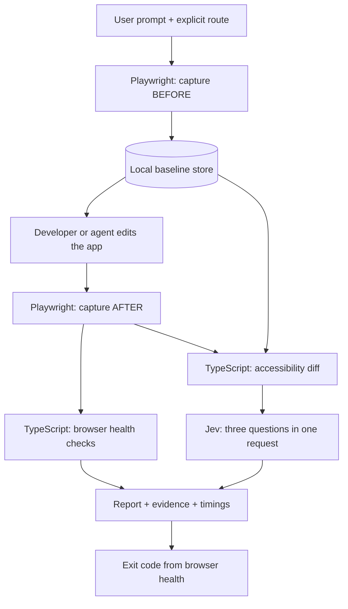

# jev-uicheck-fast

**Check what changed in your web UI against what you asked for.**

Playwright captures the real page. TypeScript computes a before/after accessibility diff. Jev evaluates that diff against your prompt in one batched request, alongside local browser health checks.

Built for local web development with coding agents. Use it as a **CLI, TypeScript/JavaScript library, or automatic Claude Code/Codex hook** for one configured route. The hook captures BEFORE at prompt submission and checks AFTER when the agent tries to finish.

> Unofficial community project. Not affiliated with or endorsed by TypeSafe.

## What works today

| Capability | Status |
| --- | --- |
| Console errors, uncaught exceptions, failed requests, HTTP errors | Local health checks |
| Capture completion and nonempty accessible content | Local health checks |
| BEFORE/AFTER snapshots, persistent baselines, line-level diffs | Library |
| Prompt intent, unexpected changes, regressions | Jev advisory checks through the library |
| Readable reports, JSON evidence, exit codes, stage timings | Available |
| Claude Code and Codex prompt/stop hooks, one route, up to three repair requests | Available; protocol and browser integration tested |
| Automatic route discovery | Planned |
| Warm browser daemon, interaction scenarios, OpenRouter | Planned |
| Error-boundary, suspicious-text, and missing-label checks | Planned |

The standalone URL command checks page health without an API key. The library and agent hooks add before/after comparison and Jev. A clean health result alone does not prove a button works or that the requested change was implemented.

## How it works



The browser supplies the evidence, not the coding agent. Each capture records the body's ARIA snapshot, URL, title, console errors, uncaught exceptions, failed network requests, and HTTP responses with status 400 or higher.

Jev receives the saved prompt, changed snapshot lines, and URL/title changes. It answers three fixed questions written in code: did the change satisfy the request, were there unexpected changes, and did something regress? Each answer is `satisfied`, `violated`, or `insufficient_evidence`, with probabilities and confidence. Jev neither generates these questions nor controls the browser.

Both agent adapters wrap this library:

```text
Prompt submitted → save BEFORE → agent edits → tries to finish
                                      ↑               │
                                      │          AFTER checks
                                      │               │
                                      └── failure ────┘
                                          max 3 repairs
```

Run `init-claude` or `init-codex` once for the target app to install its hooks. Confirmed browser errors can ask the agent to continue; Jev verdicts remain advisory. The standalone health command does not install hooks.

## Terminal wireframe

There is no dashboard to open. Results are text or JSON. This is an illustrative, shortened combined report:

```text
UI check (0.20s total)
✗ UI health — 5 passed, 1 failed, 0 uncertain (0.04s)
  http://localhost:3000/login
  ✓ Page capture: Page reached its capture checkpoint.
  ✓ Accessible content: Accessibility snapshot contains content.
  ✗ HTTP error responses: 1 error event(s) observed.
      event:1 GET http://localhost:3000/api/session → 500

? Jev advisory — jev-1.13.0 (0.16s)
  ? Prompt intent: insufficient evidence
  ? Unexpected changes: violated
  ? Regression: violated

Exit code: 1 (browser health only; Jev is advisory).
```

Actual model output also includes probabilities and confidence. Shared input evidence is available in the structured report; it is not an explanation or a per-answer citation from Jev.

## Install and try it

Requires **Node.js 22+**, npm, and a running web app. The tool does not start your dev server.

### From this repository — available now

```sh
git clone https://github.com/srirsatt/jev-uicheck.git jev-uicheck-fast
cd jev-uicheck-fast
npm ci
npx playwright install chromium --only-shell
npm run check -- http://localhost:3000/login --ready 'h1' --snapshot
```

Use your app's actual route and a selector for an expected visible element. Vite commonly uses port 5173; pass that URL explicitly. Visibility is a capture checkpoint, not proof that hydration or all background work has finished.

### From npm — after the first release is published

```sh
npm install --save-dev jev-uicheck-fast playwright
npx playwright install chromium --only-shell
npx jev-uicheck-fast http://localhost:3000/login --ready 'h1' --snapshot
```

The package name is reserved only when publishing succeeds. This checkout has not been published by this change.

## Automatic checks: one-time setup

Start your app's dev server and install Chromium as above. Pick the setup command for your agent; both installers support macOS/Linux and localhost URLs. Replace `/path/to/your-app`, the URL, and `h1` with your app's values. The selector should identify something visible both before and after the edit.

### Claude Code

From this source checkout:

```sh
npm run build
node dist/cli.js init-claude --project /path/to/your-app --url http://localhost:3000/login --ready 'h1'
```

After publishing/installing the npm package, the equivalent command from your app is:

```sh
npx jev-uicheck-fast init-claude --url http://localhost:3000/login --ready 'h1'
```

Start a **new Claude Code session in the target app** after setup. No special prompt or manual checker invocation is needed each turn.

Setup creates `uicheck.config.json` and merges three command hooks into `.claude/settings.local.json`, preserving existing settings. It saves the original settings under `.jev-uicheck-fast/claude-settings-before-install.json` when a settings file existed. Rerunning setup updates this tool's hook entries without duplicating them.

### Codex

From this source checkout:

```sh
npm run build
node dist/cli.js init-codex --project /path/to/your-app --url http://localhost:3000/login --ready 'h1'
```

After publishing/installing the npm package, run from your app:

```sh
npx jev-uicheck-fast init-codex --url http://localhost:3000/login --ready 'h1'
```

Open a new **Codex CLI session in the target app**, trust the project, then use **`/hooks` to review and trust the three `Jev UI check` hooks**. Submit a new prompt afterward so BEFORE is captured. This review is required by Codex; untrusted or changed hooks are skipped. The installer does not alter trust records. See the [official Codex hook documentation](https://learn.chatgpt.com/docs/hooks).

Setup merges `.codex/hooks.json`, preserves unrelated hooks and `config.toml`, and backs up an existing hook file to `.jev-uicheck-fast/codex-settings-before-install.json`. Reruns do not duplicate this tool's hooks. Both agents can be installed in one app; their session state is isolated.

Codex hook availability was checked with CLI **0.158.0**. Use a current hook-capable release; if `/hooks` is unavailable, update Codex. If hooks are disabled, enable them before starting the session. Project hooks also require an active, trusted project configuration layer.

Codex repair continuations preserve the original prompt, BEFORE snapshot, and retry budget. They do not start a fresh check task simply because feedback arrives as another prompt.

### Shared route configuration and behavior

Both installers use the same `uicheck.config.json`:

```json
{
  "version": 1,
  "url": "http://localhost:3000/login",
  "ready": "h1",
  "timeoutMs": 5000,
  "settleMs": 300,
  "maxRetries": 3
}
```

| Event | What happens |
| --- | --- |
| `UserPromptSubmit` | Saves the submitted prompt, creates a new task ID, captures BEFORE and its browser health |
| `PostToolUse` | Marks the turn for checking; no browser or model call |
| `Stop` | Captures AFTER, compares to the original BEFORE, runs health and advisory Jev checks |
| Repeatable health failure | Returns a blocking decision with error evidence so the agent can repair and try finishing again |
| Third repair still fails | Allows completion with a visible unresolved-failure report |

Tool-completion events mark the turn, including shell and read tools. Codex also emits these events for shell commands that exit unsuccessfully. There is no file-type filtering yet, and every new prompt gets an initial completion check, even if it was conversational. Checking at completion groups rapid edits together rather than launching a browser after every file write.

Automatic repair requires a healthy BEFORE and the same error on **two complete AFTER captures**. Existing errors, incomplete snapshots, truncated evidence, and transient errors produce reports without repair requests. A stopped dev server or an absent readiness element is reported as incomplete; this first version does not ask the agent to repair those conditions. Missing Jev credentials or API failures never become semantic passes, and Jev answers never cause repairs.

A small bounded delay before AFTER navigation helps hot reload but does not prove that rebuilding finished. Both captures must reach your configured visible element. Browsers are fresh and logged out; there is no daemon yet. Hook timing includes browser startup and settling, so the warm fixture timing below is not a hook-latency claim.

Put `TYPESAFE_API_KEY` in the **target app's** ignored `.env`, or in the environment used to launch your agent, to enable Jev. The hook parses only that key from `.env`; it does not execute the file. Without a key, browser health and its automatic repair requests still work. Supplying a key sends that turn's prompt and UI diff to TypeSafe.

Each session keeps its own state under `.jev-uicheck-fast/sessions/`. Each prompt gets a task directory containing `before.json` and a directory for each check with `report.txt` and `report.json`. The hook output includes the saved report location. The original baseline and three-repair budget survive separate hook processes; a new user prompt resets the budget. Operational hook errors warn and allow completion, never report a clean pass.

The installer adds local state, the installed local hook settings, and `.env` to the app's `.gitignore`. Commands reference this installation by absolute path; rerun setup if you move it. To disable the integration, remove the three `Jev UI check` command entries from `.claude/settings.local.json` or `.codex/hooks.json`, preserving other hooks. Codex hooks can also be disabled through `/hooks`. If a process is forcibly killed and leaves `hook.lock`, remove that session's lock only after confirming no hook is running.

The adapters follow the [Claude hook reference](https://code.claude.com/docs/en/hooks) and [Codex hook reference](https://learn.chatgpt.com/docs/hooks). All **49 local tests pass**, including installed commands running across separate processes with real Chromium, failure → repair → pass for both agents, and the Codex continuation retry cap. Live Claude and Codex conversations have not yet been validated; the tests supply the documented event payloads.

## Standalone CLI options

| Option | Meaning |
| --- | --- |
| `--ready '<selector>'` | Required visible-element checkpoint |
| `--timeout 10000` | Navigation/readiness timeout per stage; default 5000 ms |
| `--snapshot` | Print the captured accessibility snapshot |
| `--json` | Print the complete capture and health report as JSON |
| `--help` | Show usage |

Each CLI invocation launches a fresh, logged-out browser. It does not inherit your regular browser session. Checks cover events observed up to the capture, not activity occurring afterward. A request that receives HTTP 404/500 is recorded separately from a request that fails to reach a server.

Exit codes: **0** = health pass, **1** = observed health failure, **2** = uncertain or setup error. These are ordinary CLI codes. The hook adapters return agent-specific JSON decisions instead.

Standalone CLI and library reports are returned or printed; the agent adapters save them automatically. From the source checkout, save standalone JSON without npm build output:

```sh
npm run build
node dist/cli.js http://localhost:3000/login --ready 'h1' --json > ui-report.json
```

## Use Jev directly

Put your TypeSafe key in an ignored `.env` file:

```dotenv
TYPESAFE_API_KEY=your_key_here
```

From the source checkout, verify the connection with:

```sh
npm run check:jev
```

This makes one real API request using a synthetic change. Regular health checks and local tests need no key. The client currently supports TypeSafe directly, using `jev-1.13.0` at `https://api.typesafe.ai/v1/systemone`.

Library calls read `TYPESAFE_API_KEY` from the process environment or accept `{ apiKey }` as their final options argument. Unlike the agent adapters, library calls do not load `.env` automatically. Requests default to a 5-second timeout, validate model responses, and do not retry automatically. Missing keys, skipped comparisons, timeouts, and invalid responses are explicit statuses, never semantic passes.

The prompt and diff are sent to TypeSafe when you invoke the semantic check. Full snapshots and browser error events are not included in that request. Local baselines contain the prompt and captured state; keep `.env` and `.jev-uicheck-fast/` ignored in your target project.

## Library example: BEFORE → edit → AFTER

After installing the package, save this as `check-ui.mjs` in your app. In this repository, the same import works after `npm run build`.

```js
import { chromium } from 'playwright';
import {
  BaselineStore,
  captureBefore,
  runCombinedCheck,
  formatCombinedReport,
  combinedExitCode,
} from 'jev-uicheck-fast';

const phase = process.argv[2];
if (!['before', 'after'].includes(phase)) {
  throw new Error('Usage: node check-ui.mjs before|after');
}

const key = {
  taskId: 'rename-login-001', // New ID for every new user prompt.
  checkpointId: 'login-logged-out',
  url: 'http://localhost:3000/login',
};
const prompt = 'Rename the Log in button to Sign in.';
const store = new BaselineStore('.jev-uicheck-fast/baselines');
const browser = await chromium.launch();

try {
  const page = await browser.newPage();
  // Pick something that should remain visible before AND after the edit.
  const options = { ready: page.locator('h1'), timeoutMs: 5000 };

  if (phase === 'before') {
    const result = await captureBefore(page, store, key, prompt, options);
    console.log(`Baseline: ${result.status}`);
    if (result.status === 'incomplete') process.exitCode = 2;
  } else {
    const { report } = await runCombinedCheck(page, store, key, options);
    console.log(formatCombinedReport(report, { includeEvidence: true }));
    process.exitCode = combinedExitCode(report);
  }
} finally {
  await browser.close();
}
```

Run BEFORE while the original app is running, make your edit, wait for the app to update, then run AFTER:

```sh
node check-ui.mjs before
# Make the requested code change, then:
node --env-file=.env check-ui.mjs after
```

Repeated AFTER runs compare against the same original baseline. A new prompt needs a new `taskId`; repeated BEFORE calls do not overwrite an existing baseline. Keep the route, checkpoint, authentication, and browser settings consistent. The library accepts an existing Playwright page, so a future daemon can reuse its browser rather than launching one for each call.

`runCombinedCheck` returns both the captured comparison and the report. Jev answers cannot change the exit code: only observed browser health does. In particular, exit code 0 does not imply Jev was available or agreed with the change.

## Tech stack and file map

| Layer | Technology | Role |
| --- | --- | --- |
| Runtime and public API | Node.js 22+, TypeScript, ESM | Typed library and CLI |
| Browser evidence | Playwright + Chromium | ARIA snapshots and browser events |
| Change extraction | `diff` | Bounded line-level snapshot comparison |
| Semantic checks | TypeSafe Jev + native `fetch` | Three batched choice questions |
| Persistence | Node filesystem + SHA-256 keys | Baselines keyed by task/checkpoint/URL |
| Validation | Node test runner + controlled browser fixtures | Unit, integration, accuracy, latency checks |

```text
src/
├── index.ts                 Public library exports
├── cli.ts                   URL → health check → terminal/JSON
├── runner.ts                Capture and combined-check orchestration
├── store.ts                 Persistent original baselines
├── jev.ts                   Direct API client and response validation
├── report.ts                Readable output and exit codes
├── browser/
│   ├── capture-state.ts     ARIA snapshot, URL, title
│   └── events.ts            Console, JavaScript, network, HTTP errors
├── hooks/
│   ├── config.ts            Route settings and both hook installers
│   ├── lifecycle.ts         Shared captures, reports, and repair budget
│   ├── claude.ts            Claude Code adapter
│   └── codex.ts             Codex adapter
└── checks/
    ├── universal.ts         Deterministic health checks
    ├── diff.ts              BEFORE/AFTER line changes
    └── questions.ts         Fixed intent questions and evidence payload
scripts/check-jev.mjs        One-request API smoke check
test/                       Local tests; Jev responses are mocked
benchmarks/                 Fixtures, measurement runner, recorded results
dist/                       Generated JavaScript and TypeScript declarations
```

## Initial benchmark

One controlled run used **30 synthetic prompt/change pairs**, each repeated three times, with a reused Chromium browser and real Jev calls.

| Metric | Result |
| --- | --- |
| Warm combined check latency | **192 ms median / 273 ms p95** |
| First-pass primary-label agreement | 24/30 (80%) |
| Known violations detected | 12/12 |
| Insufficient-evidence answers | 13/30 |
| Unsupported definite judgments on unobservable cases | 1/9 |
| Browser health fixture outcomes | 24/24 across 8 unique fixtures |

Combined latency includes AFTER navigation, capture, diff, health checks, and Jev; it excludes browser startup and the initial BEFORE capture. Labels were authored by the coding agent, and the fixtures share templates. Zero false passes in 12 known violations is a small observation, not proof of reliability. These results keep Jev advisory.

See [full results and failure cases](benchmarks/RESULTS.md) and [benchmark methodology](benchmarks/README.md). This recorded benchmark predates the hook adapter. No live-agent repair loop or Claude comparison was benchmarked.

From the source checkout:

```sh
npm test
npm run bench -- --repeats 1          # No Jev requests
npm run bench -- --live --repeats 3   # 93 real requests, including warmups
```

Raw captures, responses, CSV, and timing summaries are saved under ignored `benchmarks/results/` directories.

## Current limits

- Accessibility text has no pixels: layout, colors, overlap, and visual polish need screenshot review.
- An element existing does not prove it works. Scripted interaction scenarios are still planned.
- Backend effects cannot be established from these snapshots alone.
- A line replacement is not proof of element identity. Missing context can produce uncertainty or wrong Jev answers.
- Health checks currently flag every observed error, including expected or pre-existing errors; they do not establish which edit caused it.
- The tool waits for a specific visible element, not network idle. Automatic hot-reload settling and route discovery are not implemented.

